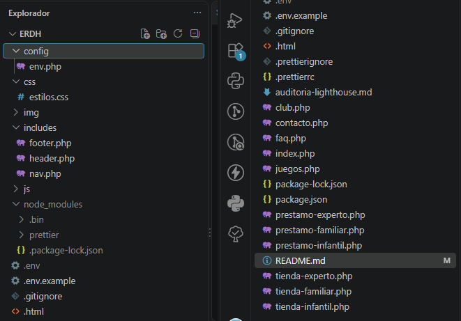

# Descripción
Aplicación web para el club y tienda de juegos de mesa El Rincón de Hermes, desarrollada originalmente a partir de los wireframes y el mockup diseñados en Figma en trabajos prácticos anteriores.

Como parte de la Unidad 4, el proyecto fue refactorizado de páginas HTML independientes a una estructura basada en PHP, incorporando plantillas reutilizables mediante header.php, nav.php y footer.php, navegación dinámica y configuración mediante variables de entorno.

## Enlaces
Repositorio: https://github.com/Florare83/ERDH
Wireframes y Mockups en Figma: https://www.figma.com/design/hipG4LOssrktKAuL9P4VDI/ERDH?node-id=16-458&t=eVWlSxP531yBRfNM-1

## Tecnologías utilizadas
HTML5 — estructura semántica de las vistas.
CSS3 — estilos personalizados mediante css/estilos.css.
Bootstrap 5.3 — sistema de grillas, navegación y componentes.
JavaScript — funcionalidades e interacción del sitio.
PHP 8.x — refactorización de las páginas y generación de contenido dinámico.
XAMPP — servidor local utilizado para ejecutar Apache y PHP.
Prettier — formateo automático del código.
Lighthouse (Chrome DevTools) — auditoría de accesibilidad y rendimiento.

## Refactorización a PHP
Durante la refactorización se reemplazaron las páginas HTML por archivos PHP.

Se implementó una estructura modular mediante plantillas reutilizables:

includes/
├── header.php
├── nav.php
└── footer.php

Las páginas principales reutilizan estas plantillas mediante require_once, evitando repetir el código del encabezado, menú de navegación y pie de página.

También se implementó navegación dinámica mediante la variable $pagina_actual, que permite determinar qué sección del menú debe mostrarse como activa.

Además, el título de cada página se establece mediante la variable $titulo_pagina.

## Variables de entorno
El proyecto utiliza un archivo .env para almacenar valores de configuración.

Las variables utilizadas son:

APP_NAME="El Rincón de Hermes"
APP_EMAIL="email@ejemplo.com"
APP_ENV=local

El archivo .env no se incluye en el repositorio y está excluido mediante .gitignore.

Para indicar las variables necesarias para ejecutar el proyecto se incluye el archivo:

.env.example

La configuración es cargada desde:

config/
└── env.php

La carpeta node_modules/ no se incluye en el repositorio porque sus dependencias pueden instalarse nuevamente mediante npm.

## Instalación y ejecución local
1. Clonar el repositorio
git clone https://github.com/Florare83/ERDH.git
2. Colocar el proyecto en XAMPP

Copiar o clonar el proyecto dentro de la carpeta:

C:\xampp\htdocs\

Por ejemplo:

C:\xampp\htdocs\ERDH
3. Crear el archivo .env

Copiar .env.example y crear un archivo .env en la raíz del proyecto.

Configurar las variables correspondientes:

APP_NAME="El Rincón de Hermes"
APP_EMAIL="email@ejemplo.com"
APP_ENV=local
4. Iniciar XAMPP

Abrir el panel de XAMPP e iniciar:

Apache
5. Abrir el proyecto

Ingresar desde el navegador a:

http://localhost/ERDH/index.php
Evidencia de funcionamiento
Servidor local ejecutándose

Captura del sitio funcionando mediante XAMPP y accediendo desde el navegador a localhost.

## Estructura modular SSI
La siguiente captura muestra la utilización de las plantillas PHP reutilizables:

header.php
nav.php
footer.php

## Navegación dinámica
Las páginas utilizan un título dinámico mediante $titulo_pagina y determinan la sección activa del menú mediante $pagina_actual.

Configuración de variables de entorno

El archivo .env.example contiene las variables necesarias para la configuración del proyecto.

## Resultado de la prueba de accesibilidad

## Servidor local XAMPP

## Estructura del proyecto actual

