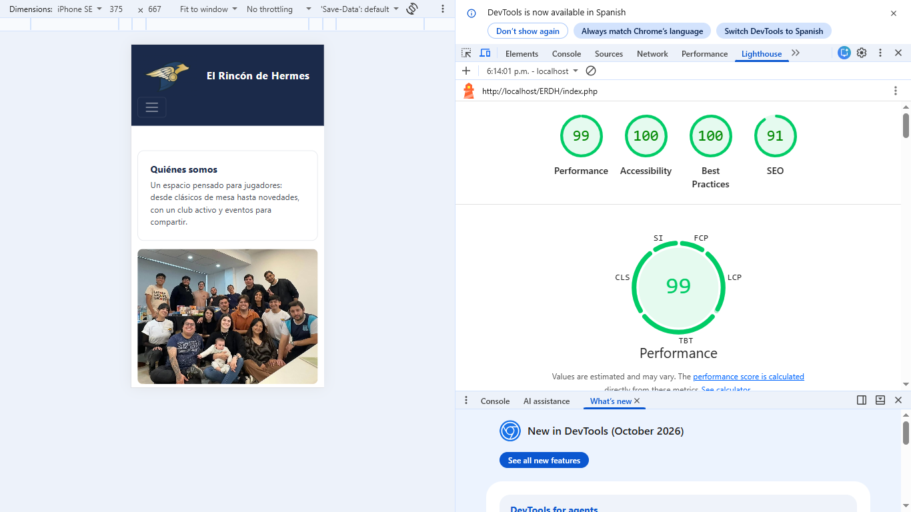

# Auditoría de Lighthouse

Documento de seguimiento de las auditorías de accesibilidad y rendimiento realizadas con Chrome DevTools (Lighthouse) sobre cada una de las 11 vistas del sitio, ejecutado en entorno local con XAMPP (`http://localhost/ERDH/`).

> Para completar la tabla: abrir cada página en Chrome → DevTools (F12) → pestaña Lighthouse → Analyze page load. Registrar el puntaje de Accesibilidad antes y después de los cambios, y el de Rendimiento.

## Notas generales

- Las vistas comparten `header.php`, `nav.php` y `footer.php` (SSI), por lo que una corrección de accesibilidad en una plantilla se aplica a todas las páginas.
- Todas las imágenes incluyen `alt` o `aria-label` descriptivo.
- El logo del menú usa un `alt` dinámico generado con el nombre del sitio (`APP_NAME` del archivo `.env`).
- El acordeón de FAQ y el formulario de contacto usan atributos ARIA nativos de Bootstrap.
- Los campos del formulario de contacto tienen `<label>` asociado mediante `for`/`id`.
- El menú de navegación indica la sección actual con la clase `active`, y cada página define su `<title>` de forma dinámica.
- Pendiente: reemplazar los placeholders por imágenes reales y volver a auditar.

## Evidencia

